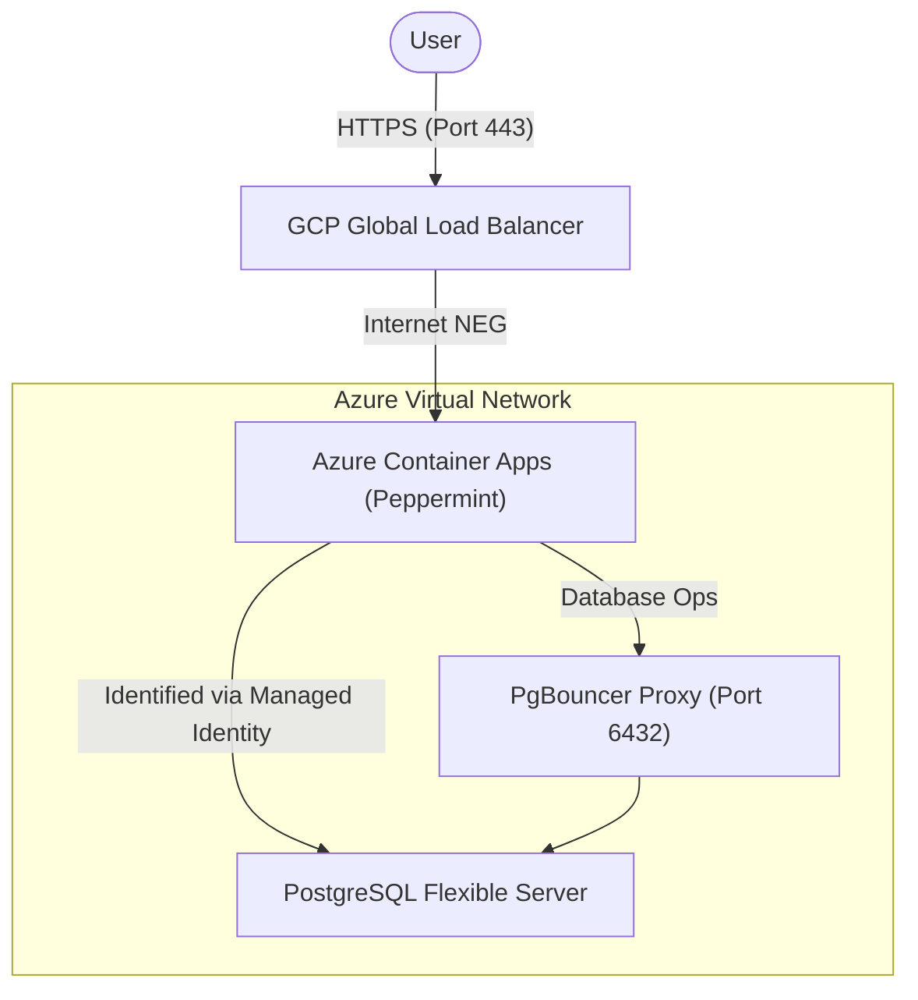

# 🍵 ESMOS Peppermint: Enterprise Ticketing for Azure Container Apps

This repository contains the deployment configuration and lifecycle management for **Peppermint**, a modern open-source ticket management system optimized for the ESMOS Healthcare platform.

## 🏗️ Key Design Principles

The ESMOS Peppermint deployment is engineered for reliability and cost-efficiency within a healthcare support framework:

*   **Connection Resilience**: Configured to connect via **PgBouncer** (Port 6432) on the Azure Database for PostgreSQL, ensuring the application remains responsive even during high-concurrency event bursts without exhausting database connections.
*   **Secure Identity**: Leverages **Azure User-Assigned Managed Identity** for seamless authentication with the Azure Container Registry (ACR), eliminating the need for hardcoded Docker credentials.
*   **Scalable & Efficient**: Optimized for **Azure Container Apps (ACA)** with scale-to-zero capabilities, minimizing infrastructure costs during low-demand periods while maintaining high availability for urgent ticketing needs.
*   **Stateless Backend**: The application is treated as an ephemeral resource, with all persistent data offloaded to the managed PostgreSQL tier.

---

## 📐 Architecture



### Component Breakdown

| Component | Technology | Responsibility |
| :--- | :--- | :--- |
| **Ticketing App** | Peppermint (Node.js) | Frontend ticket portal and management backend. |
| **Ingress** | GCP GLB + ACA Ingress | HTTPS termination and global edge delivery. |
| **Database** | PostgreSQL | Persistent store for ticket history, client data, and audit logs. |
| **Proxy** | PgBouncer | Connection pooling to maximize database throughput and efficiency. |

---

## 📂 Project Structure

```text
.
├── terraform/          # Infrastructure-as-Code for deployment to ACA
├── .github/workflows/  # CI/CD pipelines for automated image deployment
├── docker-compose.yml  # Local development environment (Database + App stack)
└── README.md           # Technical documentation and guides
```

---

## 🔐 Configuration

The application is configured via environment variables injected into the ACA container instance.

### Database Connection (via PgBouncer)
| Variable | Value | Description |
| :--- | :--- | :--- |
| `DB_HOST` | `[Managed DB Host]` | FQDN of the PostgreSQL server. |
| `DB_PORT` | `6432` | Must use the PgBouncer port to avoid connection exhaustion. |
| `DB_DATABASE`| `peppermint` | The logical database name. |
| `DB_USERNAME`| `[User]` | Database username. |
| `DB_PASSWORD`| `[Pass]` | Secret retrieved from Key Vault. |

---

## 🚀 Operational Guide

### 1. Local Development
To launch a complete Peppermint stack locally including a PostgreSQL container:
```bash
docker compose up --build
```
Access the local development portal at `http://localhost:3000`.

### 2. Infrastructure Deployment
Navigate to the terraform directory to manage the cloud-native ACA instance:
```bash
cd terraform
terraform init
terraform apply
```

### 3. Monitoring ticket logs
Application logs are streamed directly to the **Azure Log Analytics Workspace**:
```bash
az containerapp logs show --name peppermint-app --resource-group esmos-healthcare-rg
```

---
*Maintained by the ESMOS Healthcare Development Team.*
